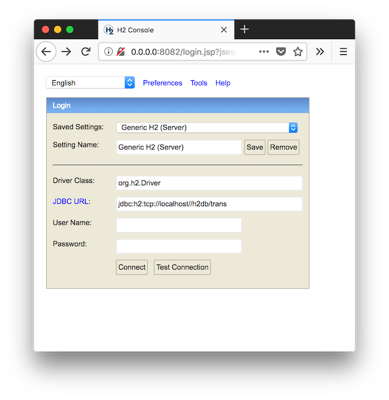

# trans-server-docker-compose
Docker Compose for [Trans Server](https://github.com/nwtgck/trans-server-akka)

## Run the server

### Step 1

```bash
# Create "https-portal.env"
cp https-portal.env.example https-portal.env 
```

Then, replace "trans-akka.ml" with your domain

### Step 2

Run docker compose

```bash
docker-compose up
```


Wait for long time when you see the following message.

```
...
https-portal_1  | This is going to take a long time
...
````

Done!

## Data Persistence
All data for persistence are under `./docker_volumes`.

* Trans File Storage in `./docker_volumes/trans-db/file_db`
* Trans H2 Database in `./docker_volumes/h2db/`
* Certificates in `./docker_volumes/ssl_certs`.

## How to access to H2 Database Web Console

1. Use SOCKS proxy

```
ssh -D 1080 <your server>
```

2. Open <http://0.0.0.0:8082/> in your browser which is already configured SOCKS proxy setting.
1. Select [Generic H2 (Server)] in "Saved Settings"
1. Fill "jdbc:h2:tcp://localhost//h2db/trans" in "JDBC URL"
1. Set empty name "" in "User Name"

The complete setting is like the following image.


